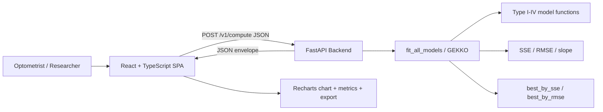
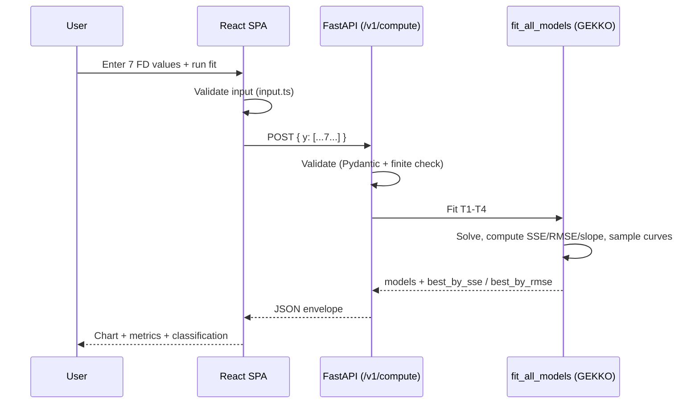
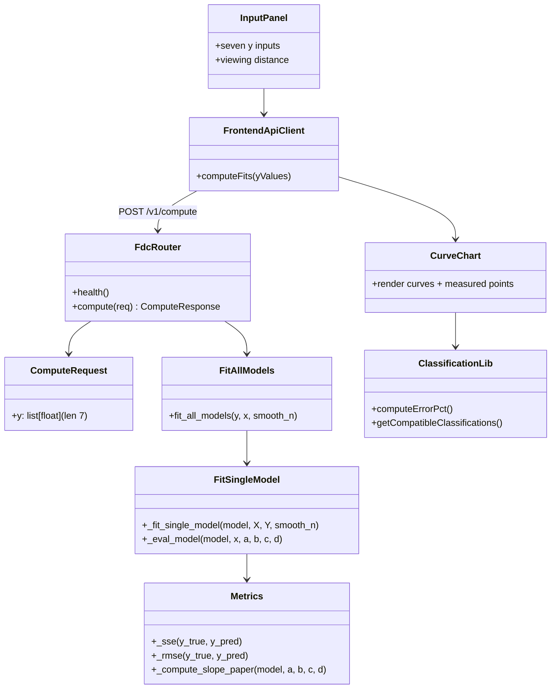

# Fixation Disparity Curve Web Application — Technical Documentation

> This document describes the web application I developed as the software
> component of my Final Degree Project (TFG). It is written to be reusable as a
> chapter of my thesis report (*memòria*). Every technical statement in this
> document was derived directly from the source code in this repository. Where
> the code does not allow me to state something with certainty, I have written a
> `TODO: verify` marker instead of guessing.

---

## 1. Purpose and scope

### What the application does

The Fixation Disparity Curve (FDC) web application takes a small set of clinical
measurements — seven fixation-disparity values measured at seven fixed vergence
positions — and fits four parametric mathematical models to them. For each model
it computes goodness-of-fit metrics (SSE and RMSE) and a slope descriptor, and it
reports which model best explains the patient's data. The fitted curves and the
measured points are then plotted together in the browser so the result can be
inspected visually, and the result can be exported as a PNG image or a PDF
clinical report.

The seven measurement positions are fixed at `[-15, -10, -5, 0, 5, 10, 15]` prism
diopters (defined in [backend/app/services/fdc_fit.py](../backend/app/services/fdc_fit.py)
as `DEFAULT_X` and mirrored in the frontend as `FIXED_X_VALUES` in
[frontend/src/constants/fdc.ts](../frontend/src/constants/fdc.ts)).

### Why it exists in the thesis

My thesis builds on the paper *Mathematical models to describe fixation disparity
curves* by Argilés et al. (2025). The paper proposes four type-specific
mathematical models for the classical FDC curve types and shows that they classify
curves more objectively than the manual, visual approach historically used in
clinics. The clinical measurement and analysis had previously been done with
paper cards and spreadsheets, which is subjective and hard to reproduce. I built
this application so that the paper's methodology could be applied directly in a
browser, turning a manual, expert-dependent process into a reproducible and
transparent one.

### Who uses it

The intended users are optometrists, vision-science researchers, and clinicians
who already collect fixation-disparity measurements during binocular-vision
assessment. The application assumes the user knows how to obtain the seven
measurements clinically (for example with a Wesson fixation-disparity card); it
does not perform the measurement itself.

### What clinical/research process it supports

It supports the *analysis* step that follows data collection: fitting candidate
models, comparing their errors, identifying the most likely curve type, and
producing a chart and report for the patient record or a study dataset.

### Modelling and classification, not clinical replacement

The application performs mathematical modelling and classification only. It is a
decision-support instrument: it reports which model fits the data best and the
associated descriptors, but it does not make a diagnosis and is not a substitute
for clinical interpretation by a qualified professional.

### In scope

- Input of seven fixation-disparity values for the fixed vergence positions.
- Constrained nonlinear fitting of the four FDC models.
- Computation of SSE, RMSE, and a slope descriptor per model.
- Selection of the best model by SSE and by RMSE.
- Interactive visualisation of all four curves with the measured points.
- PNG and PDF export.

### Out of scope

- Patient data persistence, user accounts, or any database (the backend is
  stateless).
- Acquisition of the raw clinical measurement.
- Formal clinical validation of the classification (this is research/educational
  software).

---

## 2. Functional overview

The features below correspond to code that exists in the repository.

| Feature | Where it lives | Notes |
|---|---|---|
| Seven-point fixation-disparity input | [InputPanel.tsx](../frontend/src/components/InputPanel.tsx) | One numeric field per fixed x position. |
| Viewing-distance selector (40 cm / 25 cm) | [InputPanel.tsx](../frontend/src/components/InputPanel.tsx), [constants/fdc.ts](../frontend/src/constants/fdc.ts) | UI selection only — it is **not** sent to the backend (see note below). |
| Input parsing/validation | [lib/input.ts](../frontend/src/lib/input.ts) | Rejects empty/non-finite values before any request is sent. |
| Backend computation endpoint | [main.py](../backend/app/main.py) | `POST /v1/compute`. |
| Curve fitting (four models) | [fdc_fit.py](../backend/app/services/fdc_fit.py) | GEKKO-based constrained optimisation. |
| Type I–IV model functions | [fdc_fit.py](../backend/app/services/fdc_fit.py) | `_eval_model` and `_fit_single_model`. |
| SSE / RMSE metrics | [fdc_fit.py](../backend/app/services/fdc_fit.py) | `_sse`, `_rmse`. |
| Slope descriptor | [fdc_fit.py](../backend/app/services/fdc_fit.py) | `_compute_slope_paper`: `|f(3) − f(−3)| / 6`. |
| Model comparison / classification | [fdc_fit.py](../backend/app/services/fdc_fit.py) | `best_by_sse`, `best_by_rmse`. |
| Compatibility filtering (NRMSE) | [lib/classification.ts](../frontend/src/lib/classification.ts) | Frontend-side; flags models below a 10 % NRMSE threshold. |
| Curve/scatter chart | [CurveChart.tsx](../frontend/src/components/CurveChart.tsx), Recharts | Four curves + seven measured points. |
| Classification card | [ClassificationCard.tsx](../frontend/src/components/ClassificationCard.tsx) | Best fit, slope, FD at x = 0, associated phoria. |
| Advanced metrics table | [AdvancedMetricsSection.tsx](../frontend/src/components/AdvancedMetricsSection.tsx), [MetricsTable.tsx](../frontend/src/components/MetricsTable.tsx) | Per-model SSE/RMSE/slope, best row highlighted. |
| Hover read-out | [HoverReadoutPanel.tsx](../frontend/src/components/HoverReadoutPanel.tsx), [lib/chartHover.ts](../frontend/src/lib/chartHover.ts) | Interpolated values under the cursor. |
| PNG export | [lib/exportChart.ts](../frontend/src/lib/exportChart.ts) | Renders the chart SVG to PNG. |
| PDF clinical report | [lib/pdfReport.ts](../frontend/src/lib/pdfReport.ts), [PdfExportDialog.tsx](../frontend/src/components/PdfExportDialog.tsx), jsPDF | Optional subject details + chart image. |
| Rate limiting | [main.py](../backend/app/main.py), slowapi | 30 requests/minute per IP on `/v1/compute`. |
| Error handling | [main.py](../backend/app/main.py), [api/fdc.ts](../frontend/src/api/fdc.ts) | 400/422/429/500 mapped to user-facing messages. |

> **Note on the viewing-distance selector.** The UI requires a viewing distance
> to be chosen before the fit runs ([lib/input.ts](../frontend/src/lib/input.ts),
> `validateViewingDistance`), but the value is not included in the request body to
> the backend ([api/fdc.ts](../frontend/src/api/fdc.ts) sends only `{ y }`). It
> therefore acts as a clinical-context label/guard in the current implementation.
> `TODO: verify` whether the viewing distance is intended to influence the
> computation in a future revision.

There are no features marked "planned but stubbed" in the code beyond the empty
`docs/model-and-errors.md` placeholder (now superseded by Sections 7–8 of this
document).

---

## 3. Architecture

The application is a full-stack, two-tier system:

- a **Python/FastAPI backend** that performs all numerical work (model fitting,
  metrics, model selection); and
- a **React/TypeScript single-page frontend** that handles input, visualisation,
  and export.

### Why a full-stack architecture

The numerical core depends on a constrained nonlinear optimiser (GEKKO) and the
scientific Python stack (NumPy), which are not available in the browser. Keeping
the mathematics on a Python backend lets me reuse the exact libraries the research
ecosystem uses, while the frontend stays focused on presentation. This is a clean
separation of concerns: the backend owns *computation*, the frontend owns
*interaction and display*. The two communicate over a single JSON HTTP endpoint.

### How the frontend talks to the backend

The frontend issues `POST {VITE_API_URL}/v1/compute` with a JSON body
(`{ "y": [...7 values...] }`) and receives a JSON envelope containing every
model's parameters, metrics, fitted values, smooth curve, and the classification
block. `VITE_API_URL` is configured per environment:

- development — `http://127.0.0.1:8000` ([frontend/.env.development](../frontend/.env.development));
- production — `/api` ([frontend/.env.production](../frontend/.env.production)),
  expected to be reverse-proxied to the backend.

In development the Vite dev server additionally proxies `/api` to
`http://localhost:8000` ([vite.config.ts](../frontend/vite.config.ts)).

### API structure and OpenAPI

FastAPI automatically generates an OpenAPI schema and interactive documentation
(Swagger UI at `/docs`, ReDoc at `/redoc`) from the route definitions and Pydantic
models. The application title and version are set in
[main.py](../backend/app/main.py) (`TFG Fixation Disparity API`, version `0.1.0`).
A `ROOT_PATH` environment variable is supported so the docs render correctly when
the service is mounted behind a path prefix by a reverse proxy.

### Deployment structure

A [render.yaml](../render.yaml) blueprint defines a Render web service for the
backend: root directory `backend/`, build command `pip install -r requirements.txt`,
start command `uvicorn app.main:app --host 0.0.0.0 --port $PORT`, with
`ALLOWED_ORIGINS` set as an environment variable. The module docstring in
[main.py](../backend/app/main.py) documents an external mapping in which an nginx
proxy strips an `/api` prefix before requests reach FastAPI. `TODO: verify` the
current production hosting details (the frontend is intended to be served as a
static build behind UPC infrastructure).

### Architecture diagram



---

## 4. Repository structure

The tree below uses the actual file and folder names in the repository. Generated
artefacts (`node_modules/`, `__pycache__/`, `dist/`) are omitted.

```
TFG-Fixation-Disparity-Curves/
├── render.yaml                       # Render deployment blueprint (backend service)
├── PRODUCT.md                        # Product brief / design principles
├── backend/
│   ├── app/
│   │   ├── main.py                   # FastAPI app: routes, CORS, rate limiting
│   │   └── services/
│   │       └── fdc_fit.py            # Curve fitting, metrics, slope, classification
│   ├── tests/
│   │   ├── conftest.py               # Puts backend/ on sys.path for imports
│   │   ├── test_fdc_fit.py           # Unit + integration tests for the fitter
│   │   └── test_main.py              # HTTP tests via FastAPI TestClient
│   ├── pytest.ini                    # pytest config (testpaths, "slow" marker)
│   ├── requirements.txt              # Pinned runtime dependencies
│   └── requirements-dev.txt          # Test-only dependencies (pytest, httpx)
├── frontend/
│   ├── index.html                    # SPA entry HTML
│   ├── package.json                  # Scripts and dependencies
│   ├── vite.config.ts                # Dev server + /api proxy
│   ├── vitest.config.ts              # Test runner config (jsdom, coverage)
│   ├── eslint.config.js              # ESLint flat config
│   ├── tsconfig*.json                # TypeScript project references
│   ├── .env.development / .env.production  # VITE_API_URL per environment
│   ├── images/UPC_Logo.png           # Header logo
│   └── src/
│       ├── main.tsx                  # ReactDOM bootstrap
│       ├── App.tsx                   # Root component / orchestration
│       ├── App.css, index.css        # Styling
│       ├── api/fdc.ts                # computeFits(): calls POST /v1/compute
│       ├── constants/fdc.ts          # Fixed x, axis domain, model labels/colors
│       ├── types/fdc.ts              # Shared TypeScript types
│       ├── components/               # UI components (see below)
│       ├── hooks/useClickOutside.ts  # Small UI hook
│       └── lib/                      # Pure logic modules (see below)
└── docs/
    ├── README.md                     # Project README (full documentation)
    ├── fdc-technical-documentation.md# This document
    ├── model-and-errors.md           # Model/metrics notes
    ├── presentationPreparationFDC.md # Background + presentation notes
    ├── TFG_Documentation.tex / .pdf  # Thesis document sources
    └── references/                   # Reference paper (PDF)
```

Key `src/components/` files: `InputPanel.tsx`, `CurveChart.tsx`,
`ClassificationCard.tsx`, `AdvancedMetricsSection.tsx`, `MetricsTable.tsx`,
`HoverReadoutPanel.tsx`, `ClinicalReportChart.tsx`, `ExportMenu.tsx`,
`PdfExportDialog.tsx`, `PageHeader.tsx`, `PageFooter.tsx`.

Key `src/lib/` files: `chart.ts` (merges model curves for plotting),
`chartHover.ts` / `chartAnnotations.ts` (interaction/annotation logic),
`classification.ts` (NRMSE-based compatibility), `clinicalSummary.ts` (FD at
x = 0, associated phoria), `input.ts` (validation), `exportChart.ts` (SVG → PNG),
`pdfReport.ts` (PDF generation).

### Why this structure aids maintainability

- The backend isolates the numerical service (`services/fdc_fit.py`) from the
  HTTP layer (`main.py`), so the fitting logic can be unit-tested without a
  running server.
- The frontend separates *pure logic* (`src/lib/`, no React) from *components*
  (`src/components/`), so the calculations that derive clinical readouts can be
  tested in isolation and reused.
- Shared assumptions (the fixed x positions) are defined once on each side with an
  explicit cross-reference comment to keep them in sync.
- Test-only Python dependencies are split into `requirements-dev.txt` so the
  production image stays lean.

---

## 5. Technology choices

I only list technologies that actually appear in the repository
([requirements.txt](../backend/requirements.txt),
[requirements-dev.txt](../backend/requirements-dev.txt),
[package.json](../frontend/package.json)).

### Backend

| Technology | Version | What I use it for | Why it is appropriate |
|---|---|---|---|
| Python | 3.x (not pinned) | Implementation language for the numerical core | De-facto language for scientific computing; matches the research ecosystem. |
| FastAPI | 0.129.2 | HTTP API framework | Minimal boilerplate, type-driven validation, automatic OpenAPI docs. |
| Pydantic | 2.12.5 | Request schema / validation | Declarative validation of the input vector (`conlist`), clear 422 errors. |
| NumPy | 2.4.2 | Vectorised math, curve evaluation, metrics | Fast, standard array operations for evaluating models and SSE/RMSE. |
| GEKKO | 1.3.2 | Constrained nonlinear model fitting | Lets me express per-model parameter bounds and inequality constraints and solve them. |
| slowapi | 0.1.9 | Rate limiting | Simple in-memory request throttling without external infrastructure. |
| Uvicorn | 0.41.0 | ASGI server | Standard production/development server for FastAPI. |
| pytest | 9.0.3 (dev) | Test runner | Concise tests, fixtures, markers for slow integration tests. |
| httpx | 0.28.1 (dev) | Test HTTP client | Backs FastAPI's `TestClient` for endpoint tests. |

> The thesis brief I was given mentioned SciPy and Ruff as possible technologies.
> **Neither is present in this repository.** The fitting is performed by **GEKKO**,
> not `scipy.optimize`, and there is **no Ruff configuration**. I document only
> what the code actually uses.

### Frontend

| Technology | Version (semver) | What I use it for | Why it is appropriate |
|---|---|---|---|
| React | ^19.2.0 | UI component model | Declarative, component-based UI; large ecosystem. |
| TypeScript | ~5.9.3 | Static typing | Catches shape mismatches between API and UI at compile time. |
| Vite | ^7.3.1 | Dev server + bundler | Fast HMR, simple env handling, built-in dev proxy. |
| Recharts | ^3.7.0 | Charting | Declarative React charts for the multi-curve + scatter plot. |
| jsPDF | ^4.2.1 | PDF generation | Generates the clinical PDF report entirely client-side. |
| Vitest | ^4.1.4 | Test runner | Vite-native testing with a `jsdom` environment. |
| @testing-library/react | ^16.3.2 | Component testing | Encourages behaviour-focused component tests. |
| ESLint | ^9.39.1 | Linting | Enforces code quality via a flat config. |
| typescript-eslint | ^8.48.0 | TS-aware lint rules | Type-aware linting for TypeScript sources. |

> **No Prettier configuration is present** in the repository, so formatting is not
> automated.

### How these support the thesis goals

The Python stack reproduces the paper's mathematical approach faithfully and keeps
the numerical work auditable, while React/TypeScript/Recharts make that work
*visible and explainable* to a clinical user. The strong typing on the frontend
and the schema validation on the backend together reduce the chance that a result
is silently wrong — which matters for a reproducibility-oriented tool.

---

## 6. Backend design

### Entry point and routing

The backend entry point is [backend/app/main.py](../backend/app/main.py). It
creates the FastAPI application, configures CORS and rate limiting, defines the
request schema, and registers the routes. The numerical work is delegated to
`fit_all_models` in [fdc_fit.py](../backend/app/services/fdc_fit.py).

Routes as defined in the code (internal paths):

| Method | Path | Purpose |
|---|---|---|
| GET | `/health` | Liveness probe. |
| GET | `/v1/health` | Same probe, versioned path. |
| POST | `/v1/compute` | Fit all four models and return results + classification. |

The module docstring documents an external mapping where a reverse proxy exposes
these as `/api/health` and `/api/v1/compute`. The production frontend is
configured with `VITE_API_URL=/api` accordingly.

### Request schema and validation

```python
class ComputeRequest(BaseModel):
    y: conlist(float, min_length=7, max_length=7)
```

Pydantic enforces that `y` is a list of exactly seven floats; violations produce a
`422 Unprocessable Entity` before any computation runs. A second layer of
validation inside `fit_all_models` checks the array shape and rejects non-finite
values (`NaN`, `±Infinity`) by raising `ValueError`, which the route converts to
`400 Bad Request`.

### Numerical service

All fitting logic lives in [fdc_fit.py](../backend/app/services/fdc_fit.py):

- `fit_all_models(y, x=DEFAULT_X, smooth_n=200)` — public entry point; validates
  input, fits each of the four models, selects the best, and assembles the
  response dictionary.
- `_fit_single_model(model, X, Y, smooth_n)` — builds and solves one GEKKO model.
- `_eval_model(model, x, a, b, c, d)` — evaluates a fitted model with NumPy.
- `_sse`, `_rmse` — error metrics.
- `_compute_slope_paper` — slope descriptor.
- `_build_smooth_x` — generates the 200-point plotting grid.

(Details of the mathematics are in Sections 7 and 8.)

### Error handling

```python
@app.post("/v1/compute")
@limiter.limit("30/minute")
def compute(request: Request, req: ComputeRequest):
    try:
        return fit_all_models(req.y)
    except ValueError as e:
        raise HTTPException(status_code=400, detail=str(e))
    except Exception as e:
        raise HTTPException(status_code=500, detail=f"Computation failed: {e}")
```

| Status | Cause |
|---|---|
| 200 | Successful fit. |
| 400 | Validation failure inside `fit_all_models` (wrong length, non-finite). |
| 422 | Pydantic schema violation (wrong type/length in the body). |
| 429 | Rate limit exceeded (30 requests/minute per IP, via slowapi). |
| 500 | Unexpected failure from the solver/NumPy, wrapped as `Computation failed: …`. |

### CORS

```python
app.add_middleware(
    CORSMiddleware,
    allow_origins=["*"],
    allow_credentials=False,
    allow_methods=["*"],
    allow_headers=["*"],
)
```

The middleware is currently configured to allow **all origins**. The code also
reads an `ALLOWED_ORIGINS` environment variable into a list (`_allowed_origins`),
but that list is **not** passed to the middleware in the current code — it is
computed and then unused. `TODO: verify` the intended CORS policy and, if
origin restriction is desired in production, wire `_allowed_origins` into
`allow_origins`.

### Swagger / OpenAPI

FastAPI serves interactive documentation at `/docs` (Swagger UI) and `/redoc`
(ReDoc), generated from the route signatures and the `ComputeRequest` model. No
manual OpenAPI file is maintained.

### FDC endpoint reference

#### `POST /v1/compute`

- **Method / path:** `POST /v1/compute` (externally `POST /api/v1/compute`).
- **Purpose:** Fit the four FDC models to seven measured y-values at the fixed x
  positions and return per-model results plus the classification.
- **Validation rules:** `y` must be exactly seven finite floats; otherwise 422
  (schema) or 400 (non-finite).

**Request body**

```json
{ "y": [-3.2, -2.1, -1.0, 0.0, 1.1, 2.3, 3.4] }
```

**Response body (shape)**

```json
{
  "x": [-15, -10, -5, 0, 5, 10, 15],
  "measured": [{ "x": -15, "y": -3.2 }, "… 7 points …"],
  "models": {
    "T1": {
      "params": { "a": 0.0, "b": 0.0, "c": 0.0 },
      "sse": 0.0,
      "rmse": 0.0,
      "slope": 0.0,
      "fitted_at_x": ["… 7 floats …"],
      "curve": [{ "x": -15.0, "y": 0.0 }, "… 200 points …"]
    },
    "T2": { "params": { "a": 0, "b": 0, "c": 0, "d": 0 }, "…": "…" },
    "T3": { "params": { "a": 0, "b": 0, "c": 0, "d": 0 }, "…": "…" },
    "T4": { "params": { "a": 0, "b": 0, "c": 0, "d": 0 }, "…": "…" }
  },
  "classification": {
    "best_by_sse": "T1",
    "best_by_rmse": "T1"
  }
}
```

Notes: model `T1` returns three parameters (`a`, `b`, `c`); `T2`–`T4` return four
(`a`, `b`, `c`, `d`). `curve` has `smooth_n` points (200 by default).

#### `GET /v1/health` (and `GET /health`)

- **Purpose:** Liveness probe used by the host platform.
- **Request body:** none.
- **Response:** `{ "status": "ok" }`.

> The backend also contains shared infrastructure (CORS, rate limiting, health
> checks). I am not aware of separate visual-acuity endpoints in this repository;
> the only computational endpoint present is `POST /v1/compute`. `TODO: verify`
> if visual-acuity functionality is expected to share this backend in a later
> stage.

---

## 7. Mathematical model implementation

> This section is the most important for the thesis. Every formula below is copied
> from the code; I have **not** invented any. The clinical justification of the
> exact constraint values should be confirmed against the reference paper —
> see the `TODO: verify` markers.

### Which models are implemented

Four models are implemented, named `T1`–`T4` and displayed as Type I–IV. They are
defined in [fdc_fit.py](../backend/app/services/fdc_fit.py), in both the GEKKO
constraint setup (`_fit_single_model`) and the NumPy evaluation (`_eval_model`).

| Model | UI label | Equation (from `_eval_model`) | Parameters |
|---|---|---|---|
| T1 | Type I | `y = a + b·(x − c)³` | a, b, c |
| T2 | Type II | `y = a + b·exp(−c·(x − d))` | a, b, c, d |
| T3 | Type III | `y = a − b·exp(c·(x − d))` | a, b, c, d |
| T4 | Type IV | `y = a − b·arctan(c·(x − d))` | a, b, c, d |

### Parameters, initial guesses, and constraints

All four models start from the same GEKKO initial values
(`_fit_single_model`): `a = 0`, `b = 0.1`, `c = 0.1`, `d = 0`. The bounds and
inequality constraints, copied from the code, are:

| Model | Bounds (from code) | Inequality constraints (from code) |
|---|---|---|
| T1 | `a ∈ [-10, 10]`, `c ∈ [-10, 10]` | none |
| T2 | `b ≥ 0.1`, `c ≥ 0.1` | `a + b·exp(−c·(x₇ − d)) ≥ -10` |
| T3 | `b ≥ 0.1`, `c ≥ 0.1` | `a − b·exp(c·(x₁ − d)) ≤ 10` |
| T4 | `a ∈ [-10, 10]`, `d ∈ [-10, 10]`, `b ≥ 0.1`, `c ∈ [0.1, 10]` | `a − b·atan(c·(x₁ − d)) ≤ 10`, `a − b·atan(c·(x₇ − d)) ≥ -10` |

Here `x₁ = -15` and `x₇ = 15` are the first and last fixed positions. The
in-code comments explain the intent: bounding `a`/`c` for T1 keeps the cubic from
diverging at `x = ±15`; the positive lower bounds on `b`/`c` keep the
exponential/arctangent amplitudes and rates physically meaningful; and the upper
bound `c ≤ 10` for T4 prevents a near-vertical arctangent that would degenerate
into a step. The inequality constraints keep the fitted curve within roughly
`[-10, 10]` arcmin at the extremes of the measurement range.

> `TODO: verify` that these exact bounds (`±10`, `0.1`, `10`) match the
> clinically-derived constraints in Argilés et al. (2025). The code documents them
> as "based on what the reference paper recommends", but the precise values should
> be cross-checked with the paper or my supervisor before citing them as the
> paper's.

### Optimisation method

Each model is fitted independently with GEKKO in steady-state optimisation mode
(`m.options.IMODE = 3`), running locally (`GEKKO(remote=False)`). The objective is
the sum of squared errors, expressed as a GEKKO intermediate variable:

```python
def _fit_error(m, y_pred, y_true):
    return m.Intermediate(
        sum((y_pred[i] - float(y_true[i])) ** 2 for i in range(len(y_true)))
    )
```

The code notes that, for a fixed dataset length, minimising SSE yields the same
optimum as minimising RMSE, so SSE is used directly as the objective.

### How curve samples are generated

After solving, the fitted parameters are read back and the model is evaluated on a
dense grid for plotting. `_build_smooth_x` produces `smooth_n` (default 200)
evenly-spaced points across the input range with `numpy.linspace`, and
`_eval_model` evaluates the fitted model on that grid. The model is also evaluated
at the seven original x positions (`fitted_at_x`) so the residuals can be inspected.

### How degenerate fits are avoided

The per-model lower bounds (`b ≥ 0.1`, `c ≥ 0.1`) and the upper bound on T4's `c`
prevent zero-amplitude, zero-rate, or near-vertical degenerate solutions. Input
validation in `fit_all_models` rejects non-finite measurements up front. The test
suite explicitly exercises edge cases such as all-zero input and low-amplitude
cubic data.

### Limitations of the fitting approach

- Each model is fitted from a single fixed initial guess, so the solution depends
  on GEKKO's local solver and the starting point; a global optimum is not
  guaranteed.
- With only seven data points, noisy or atypical measurements can shift which
  model wins.
- The constraints encode a plausible physiological range; if a real curve lies
  outside it, the fit will be biased toward the bounds. `TODO: verify` constraint
  appropriateness against the paper.

### Code references

| File · function | Role |
|---|---|
| [fdc_fit.py](../backend/app/services/fdc_fit.py) · `_eval_model` | Closed-form evaluation of each model with NumPy. |
| [fdc_fit.py](../backend/app/services/fdc_fit.py) · `_fit_single_model` | GEKKO variable/bound/constraint setup and solve for one model. |
| [fdc_fit.py](../backend/app/services/fdc_fit.py) · `_fit_error` | SSE objective as a GEKKO intermediate. |
| [fdc_fit.py](../backend/app/services/fdc_fit.py) · `_build_smooth_x` | 200-point plotting grid. |
| [fdc_fit.py](../backend/app/services/fdc_fit.py) · `fit_all_models` | Orchestration + response assembly. |

---

## 8. Metric calculation and classification

### SSE and RMSE

```python
def _sse(y_true, y_pred):
    return float(np.sum((y_true - y_pred) ** 2))

def _rmse(y_true, y_pred):
    return float(np.sqrt(_sse(y_true, y_pred) / len(y_true)))
```

SSE is the sum of squared residuals between the seven measured values and the
model's fitted values at those positions; RMSE is `sqrt(SSE / n)` with `n = 7`.
Both are computed for every model in `_fit_single_model`.

### Slope descriptor

```python
def _compute_slope_paper(model, a, b, c, d):
    fL = _eval_model(model, [-3.0], a, b, c, d)[0]
    fR = _eval_model(model, [ 3.0], a, b, c, d)[0]
    return abs(fR - fL) / 6.0
```

The slope is the paper-defined central descriptor `|f(3) − f(−3)| / 6`: the
absolute change in fitted fixation disparity over the central ±3 prism-diopter
interval, divided by its width. Evaluating all models the same way makes the slope
comparable across curve types.

### Other descriptors (computed on the frontend)

Two clinical descriptors are derived in
[clinicalSummary.ts](../frontend/src/lib/clinicalSummary.ts) from the **measured**
points (not the fitted curve):

- **Fixation disparity** — the measured `y` at `x = 0`.
- **Associated phoria** — the measured non-central x nearest to 0 at which `y = 0`.

`-0` results are normalised to `+0` to avoid `-0.000` readouts.

### How model comparison and selection work

In `fit_all_models` the four results are compared and the best is chosen by
minimum error, independently for each metric:

```python
best_by_sse  = min(results, key=lambda r: r.sse).model
best_by_rmse = min(results, key=lambda r: r.rmse).model
```

Both are returned in the `classification` block. The frontend treats
`best_by_sse` as the primary result (see [types/fdc.ts](../frontend/src/types/fdc.ts)),
and `best_by_rmse` is surfaced for comparison in the advanced metrics view. The
selection is therefore **minimum-error based**, not rule-based on curve shape.

### Compatibility filtering (frontend)

[classification.ts](../frontend/src/lib/classification.ts) adds a normalised view:
`errorPct = (rmse / yRange) × 100` where `yRange = max(y) − min(y)` of the measured
data (NRMSE). Models below a 10 % threshold are flagged as "compatible", letting
the UI show that more than one model may explain the data. When the data is
degenerate (`yRange < 1e-10`), `errorPct` is set to 100 so no spurious match is
reported.

### How result explanations are generated

The "explanation" the user sees is the combination of: the highlighted best model,
its SSE/RMSE/slope in the metrics table, the overlaid curves against the measured
points, and the compatibility flags. There is no natural-language generator; the
explanation is the transparent presentation of the numbers and the chart.

### End-to-end example

1. The user selects a viewing distance and enters seven values, e.g.
   `[-3.2, -2.1, -1.0, 0.0, 1.1, 2.3, 3.4]`.
2. The backend validates the input and fits T1–T4 with GEKKO.
3. For each model it computes SSE, RMSE, and the slope, and evaluates a 200-point
   smooth curve.
4. It selects `best_by_sse` and `best_by_rmse` by minimum error.
5. The frontend plots the four curves and the seven points, highlights the best
   model, shows the metrics table and the classification card (slope, FD at x = 0,
   associated phoria), and offers PNG/PDF export.

---

## 9. Frontend / web design

### Input form

[InputPanel.tsx](../frontend/src/components/InputPanel.tsx) renders a viewing-
distance `<select>` (40 cm / 25 cm) and seven numeric inputs, one per fixed x
position. The "Run Statistical Fit" button is disabled while a request is in
flight and shows an "Optimizing…" label.

### Validation feedback

Before any request, [lib/input.ts](../frontend/src/lib/input.ts) checks that a
viewing distance is chosen (`validateViewingDistance`) and that all seven values
parse to finite numbers (`parseYValues`). Failures are shown inline as field
feedback / a status message rather than being sent to the backend.

### Visualisation and metrics

[CurveChart.tsx](../frontend/src/components/CurveChart.tsx) (Recharts) overlays the
four fitted curves and the seven measured points on a fixed axis domain
(`AXIS_DOMAIN = [-20, 20]`, [constants/fdc.ts](../frontend/src/constants/fdc.ts)),
with per-model colours. [ClassificationCard.tsx](../frontend/src/components/ClassificationCard.tsx)
summarises the best fit (slope, fixation disparity at x = 0, associated phoria),
and [MetricsTable.tsx](../frontend/src/components/MetricsTable.tsx) lists per-model
SSE/RMSE/slope with the best-by-SSE row highlighted.

### Loading and error states

[App.tsx](../frontend/src/App.tsx) holds `loading` and `error` state. A version
counter (`computationVersionRef`) discards stale responses if the inputs change
mid-request, so a slow earlier request cannot overwrite a newer result.

### User flow

Enter values → run fit → inspect the chart, classification card, and metrics →
optionally hover for interpolated read-outs → export PNG or PDF.

### Why a curve type was selected

The user understands the choice because the winning model is highlighted, its
numerical error is shown alongside the competitors', and all four curves are drawn
over the real points — so the visual fit and the numbers agree on screen.

### Separation of display from computation

The frontend performs **no model fitting**. It only sends inputs, receives
results, and derives presentation-level values (merged curves, NRMSE
compatibility, clinical readouts) in the pure modules under `src/lib/`. This keeps
the heavy mathematics on the backend and the UI testable in isolation.

### Responsiveness

The layout uses a sidebar + dashboard structure with CSS in
[App.css](../frontend/src/App.css). `TODO: verify` the exact responsive
breakpoints against the CSS if precise behaviour needs to be cited.

---

## 10. API communication

### API client

[api/fdc.ts](../frontend/src/api/fdc.ts) exposes `computeFits(yValues)`. It reads
`VITE_API_URL`, strips a trailing slash, and `POST`s `{ y: yValues }` as JSON to
`/v1/compute`.

### Request / response flow and error handling

The client reads the response as text before parsing so it can surface FastAPI's
`{ "detail": … }` error message to the user. On a non-OK status it throws an
`Error` carrying that detail (or the raw text, or `HTTP <status>` as fallbacks).
On success it parses and returns the typed `ComputeResponse`.

### Serialisation

Data is serialised as JSON in both directions; the response is strongly typed on
the frontend via `ComputeResponse` in [types/fdc.ts](../frontend/src/types/fdc.ts).

### CORS

As described in Section 6, the backend currently allows all origins. In
development the Vite proxy forwards `/api` to `http://localhost:8000`
([vite.config.ts](../frontend/vite.config.ts)).

### Sequence diagram



---

## 11. Data handling, security, and privacy

- **Storage:** The backend stores nothing. There is no database, no file
  persistence, and no session state — every request is computed and discarded.
- **Statelessness:** `fit_all_models` is a pure function of its inputs; identical
  inputs always produce the same output (subject to solver tolerances).
- **Patient data:** No patient identifiers are required to compute a fit; the
  request body is only the seven numeric values. Optional subject details entered
  for the PDF report are used **only** to render the PDF in the browser
  ([pdfReport.ts](../frontend/src/lib/pdfReport.ts)) and are not transmitted to the
  backend. `TODO: verify` this claim if any analytics/telemetry is added later.
- **Input validation:** Enforced on the frontend ([input.ts](../frontend/src/lib/input.ts))
  and again on the backend (Pydantic `conlist` + the finite-value check in
  `fit_all_models`).
- **Rate limiting:** 30 requests/minute per IP via slowapi protects the compute
  endpoint from abuse.
- **CORS:** Currently permissive (`allow_origins=["*"]`); see the Section 6
  `TODO: verify`.
- **Authentication:** There is **no** authentication or authorisation. This is
  acceptable for the current scope because the service stores no personal data and
  performs a stateless numerical computation; there is nothing to protect behind a
  login. If patient-identifiable data were ever stored, authentication and
  transport hardening would become necessary.

---

## 12. Testing strategy

### Backend — pytest

Tests live in [backend/tests/](../backend/tests/). [pytest.ini](../backend/pytest.ini)
sets `testpaths = tests` and registers a `slow` marker for the GEKKO-backed
integration fits. [conftest.py](../backend/tests/conftest.py) puts `backend/` on
`sys.path`.

| Test file | What it covers | Why it matters |
|---|---|---|
| [test_fdc_fit.py](../backend/tests/test_fdc_fit.py) | Metric helpers (`_sse`, `_rmse`, `_build_smooth_x`); per-model evaluation (`_eval_model` for T1–T4); slope (`_compute_slope_paper`); input validation (wrong length, NaN, Infinity, bad x-shape); end-to-end `fit_all_models` on synthetic data with response-shape and classification assertions. | Confirms the maths and validation independently of the HTTP layer. |
| [test_main.py](../backend/tests/test_main.py) | `GET /api/v1/health`; `POST /v1/compute` validation (missing body, wrong length, non-numeric, non-finite); a full success path asserting the JSON envelope. | Confirms routing, schema validation, and the response contract. |

The integration fits use **synthetic** y-values generated from a known model, so
the expected best fit and a near-zero SSE are known in advance without needing
real clinical data.

Run them with:

```bash
cd backend
pip install -r requirements-dev.txt
pytest                 # all tests
pytest -m "not slow"   # skip GEKKO integration fits
```

### Frontend — Vitest

Tests are co-located as `*.test.ts(x)` files under `frontend/src/` and configured
in [vitest.config.ts](../frontend/vitest.config.ts) (jsdom environment,
`@testing-library/jest-dom`, shared setup in `src/test/setup.ts`). They cover the
pure logic modules (`input`, `chart`, `classification`/`clinicalSummary`,
`chartHover`, `chartAnnotations`, `constants`), the API client (`api/fdc.test.ts`,
against a mocked `fetch`), and key components (`MetricsTable`, `ClassificationCard`,
`PageHeader`, `PageFooter`, `App`).

Run them with:

```bash
cd frontend
npm test               # run once
npm run test:watch     # watch mode
npm run test:coverage  # coverage report
```

> `TODO: verify` exact test counts before quoting them in the thesis — the suite
> changes as files are added. The categories above are accurate to the current
> tree.

### Lint / type-check

- Frontend lint: `npm run lint` (ESLint).
- Frontend type-check: part of `npm run build` (`tsc -b`).
- There is no Python linter configured (no Ruff/flake8), and no Prettier.

### Suggested additional tests

If coverage needs to grow, I would add or confirm tests for: valid vs invalid FDC
input at the API boundary; each Type I–IV fit on representative real-shaped data;
SSE/RMSE numeric correctness; classification stability under small perturbations;
and that `curve` arrays return the expected length.

---

## 13. Quality controls

| Control | Command / config | Notes |
|---|---|---|
| Frontend lint | `npm run lint` ([eslint.config.js](../frontend/eslint.config.js)) | Flat config: `@eslint/js`, `typescript-eslint`, React Hooks, React Refresh. |
| Frontend type-check | `npm run build` → `tsc -b` | Strict TS via [tsconfig.app.json](../frontend/tsconfig.app.json) project references. |
| Frontend tests | `npm test` / `npm run test:coverage` | Vitest + jsdom. |
| Backend tests | `pytest` (with `requirements-dev.txt`) | pytest with a `slow` marker. |
| Dependency pinning | [requirements.txt](../backend/requirements.txt) (exact `==`), [package-lock.json](../frontend/package-lock.json) | Reproducible installs. |
| Python lint/format | — | Not configured (no Ruff, no Prettier). |
| CI | — | No `.github/workflows/` present; checks are run locally. `TODO: verify`. |

---

## 14. Version control and organisation

The project is tracked with Git and hosted on GitHub. I used commits to record
incremental progress, which gives the thesis a traceable development history and
lets me tie features and fixes to specific changes.

A formal branch strategy is **not** evident from the current history (work is on
`main`). I would *recommend* a lightweight feature-branch + pull-request workflow
for future contributors so that changes are reviewed before merging; I present
this as a recommendation, not as something already enforced.

The repository organisation itself supports maintainability: the backend/frontend
split, the isolation of pure logic from UI and HTTP layers, the separate test
folders, and pinned dependencies all make it straightforward to locate, test, and
change a given piece of behaviour.

---

## 15. Setup and execution

### Backend

```bash
cd backend
python -m venv .venv
# Windows:        .venv\Scripts\activate
# macOS / Linux:  source .venv/bin/activate
pip install -r requirements.txt
uvicorn app.main:app --reload --port 8000
```

- API base: `http://localhost:8000`
- Swagger UI: `http://localhost:8000/docs`
- ReDoc: `http://localhost:8000/redoc`

### Frontend

```bash
cd frontend
npm install
npm run dev        # Vite dev server (default http://localhost:5173)
```

In development the dev server proxies `/api` to `http://localhost:8000`, and
`VITE_API_URL` defaults to `http://127.0.0.1:8000`
([.env.development](../frontend/.env.development)).

### Production build

```bash
cd frontend
npm run build      # tsc -b && vite build  → frontend/dist/
npm run preview    # serve the built output locally
```

The production build uses `VITE_API_URL=/api`
([.env.production](../frontend/.env.production)), so the static site must be served
behind a reverse proxy that forwards `/api` to the FastAPI backend.

### Environment variables

| Variable | Side | Default | Purpose |
|---|---|---|---|
| `VITE_API_URL` | frontend (build/dev) | dev `http://127.0.0.1:8000`, prod `/api` | Base URL for API calls. |
| `ALLOWED_ORIGINS` | backend | `http://localhost:5173,https://fixationdisparitycurves.upc.edu` | Read into `_allowed_origins`; **currently unused by the CORS middleware** (see Section 6). |
| `ROOT_PATH` | backend | `""` | Path prefix for correct docs/OpenAPI behind a proxy. |

### Tests / lint

```bash
# backend
cd backend && pip install -r requirements-dev.txt && pytest

# frontend
cd frontend && npm test && npm run lint
```

---

## 16. Component / class diagram



---

## 17. Important implementation decisions

- **Full-stack design.** I split computation (Python) from presentation
  (TypeScript) so each side uses the right tools and can be tested independently.
- **Backend numerical computation with GEKKO.** Per-model bounds and inequality
  constraints are naturally expressed and solved with GEKKO, which the browser
  cannot do.
- **Frontend visualisation with Recharts.** Declarative React charts let me
  overlay four curves and the measured points cleanly and make the result
  explainable.
- **Explainable, comparable metrics.** SSE/RMSE plus the paper-defined slope are
  exposed for every model, and an NRMSE compatibility view shows when more than
  one model is plausible.
- **Minimum-error model comparison.** The winner is chosen by minimum SSE/RMSE,
  keeping the classification objective and reproducible.
- **No database.** The computation is stateless, so I deliberately avoided a
  database and authentication; this reduces attack surface and matches the scope.
- **Automatic OpenAPI docs.** FastAPI's generated Swagger/ReDoc keep the API
  contract discoverable.
- **Tests on both sides.** pytest and Vitest protect the maths and the UI logic
  and support reproducibility.

---

## 18. Limitations and future work

- **Clinical validation not completed.** The tool implements the paper's models
  but has not been independently clinically validated within this project.
- **Model correctness depends on formulas and constraints.** Results are only as
  correct as the equations and bounds; the exact constraint values should be
  confirmed against the paper (`TODO: verify`, Section 7).
- **Sensitivity to noise.** With seven points, noisy or atypical data can change
  which model wins; the local solver from a single initial guess is not guaranteed
  to find a global optimum.
- **Not a clinical replacement.** The output supports, but does not replace,
  expert interpretation.
- **Input assumptions.** The seven fixed x positions are hard-coded on both sides;
  arbitrary measurement grids are not supported.
- **Deployment limitations.** The reference deployment relies on the production
  build being served behind a proxy that maps `/api`; the free-tier backend may
  cold-start. CORS is currently permissive and should be tightened (Section 6).
- **Testing limitations.** There is no CI pipeline and no Python linter; tests run
  locally.
- **Possible improvements.** Richer, real-data validation sets; clearer
  natural-language explanation of why a type was chosen; PDF/report enhancements;
  optional persistent project/session storage (with the privacy implications that
  entails); and more side-by-side visual comparison tools.

---

## 19. Conclusion

The FDC web application meets the goals I set for the software part of my thesis.
It makes the curve fitting **reproducible** (a stateless, deterministic backend
that applies the paper's four models with explicit constraints), the model
comparison **transparent** (SSE, RMSE, and a comparable slope reported for every
model, with the winner chosen by minimum error), and the result **explainable**
(all four curves drawn against the measured points, with the best model
highlighted and the key clinical descriptors surfaced). The numerical work runs on
a Python/FastAPI backend using the scientific stack, while a React/TypeScript
frontend provides an interactive, exportable interface. The clear backend/frontend
separation and the isolation of pure logic from UI keep the system
**maintainable** and testable. Together, these turn a previously manual,
spreadsheet-and-paper process into an objective, repeatable, and shareable tool —
while remaining a decision-support instrument rather than a replacement for
clinical judgement.

---

## 20. Manual verification checklist

Before copying any of this into my thesis, I should confirm:

- [ ] **Constraint values** (`±10`, `0.1`, `c ≤ 10`) match the clinically-derived
      constraints in Argilés et al. (2025) — Section 7.
- [ ] **Model equations** T1–T4 as written here match the paper's definitions
      (signs, parameter roles) — Section 7.
- [ ] **Slope definition** `|f(3) − f(−3)| / 6` is the paper's central-slope
      descriptor — Section 8.
- [ ] **Viewing distance** is genuinely not meant to affect computation in the
      current version — Section 2.
- [ ] **CORS intent**: whether `allow_origins=["*"]` is intentional or
      `_allowed_origins` should be wired in for production — Section 6.
- [ ] **Production hosting** details (frontend host, backend URL, proxy mapping)
      are current — Sections 3 and 15.
- [ ] **Test counts** if I want to quote exact numbers — Section 12.
- [ ] **Whether any visual-acuity functionality** is expected to share this
      backend — Section 6.
- [ ] **Python and Node version requirements** for the environment I cite —
      Section 15 (versions are not pinned in the repo).
- [ ] **CI status**: confirm no pipeline is expected before stating there is none —
      Section 13.
```
